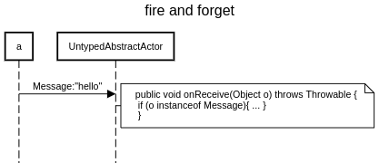
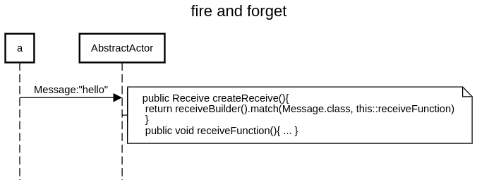

Fire and forget is also called tell

https://doc.akka.io/docs/akka/current/actors.html#send-messages

two ways for implementing our first actors:

### UntypedAbstractActor

uses `public void onReceive(Object m) throws Throwable {` and `if (m instanceof Message)`



```
title fire and forget

a->UntypedAbstractActor:Message:"hello"
space -4
note right of UntypedAbstractActor: public void onReceive(Object o) throws Throwable { \n if (o instanceof Message){ ... } \n }
```

https://sequencediagram.org/index.html#initialData=C4S2BsFMAIDMQE4wIYDsAmcD2CDmlgAoQ5AWgD4BVVYATwAdJ0BBAIwGdgFkBjYZvjgBcAWUjt2yfEIBEAC0jhwWGYXb1eMUgBZCqLMBgIQuOcGhZY0anUYsOXXv0EIh0egFdW4ED2gA3LBBMLFQAJUgeSBB-SAAKAHlWACtI8ywASmhgOQQsAHd2aAAVXILkbxgAb2gAHVRoECs4rEbUTjQoy2gxCSlIDJqAOhHoAF86hrGgA

### AbstractActor

uses `public Receive createReceive() {` and `return receiveBuilder()
				.match(Send.class, this::receiveSend)`



```
title fire and forget

a->AbstractActor:Message:"hello"
space -4
note right of AbstractActor: public Receive createReceive(){ \n return receiveBuilder().match(Message.class, this::receiveFunction) \n } \n public void receiveFunction(){ ... }

```

https://sequencediagram.org/index.html#initialData=C4S2BsFMAIDMQE4wIYDsAmcD2CDmlgAoQ5AWgD4BBAIwGdgFkBjYSlnALgFlJbbl8HAEQALSOHBYhhWgAdmMUgBZCqLMBgIQuEcGhZY0GvUYs2wTtFkBXauBBNoAJUhNIIAG4wmSZBpdunpAAFACUAN7QADqo0EjA1gixSIFeAELWIODokAhhAHQAtn5MIsE8fAKQ+UzgyHwANNDAIiC0HBwp7l4AYtaoLCBYqKHRsQC+Y1a29o4eWCCYXUF9A6DDYZH529DjhEA
